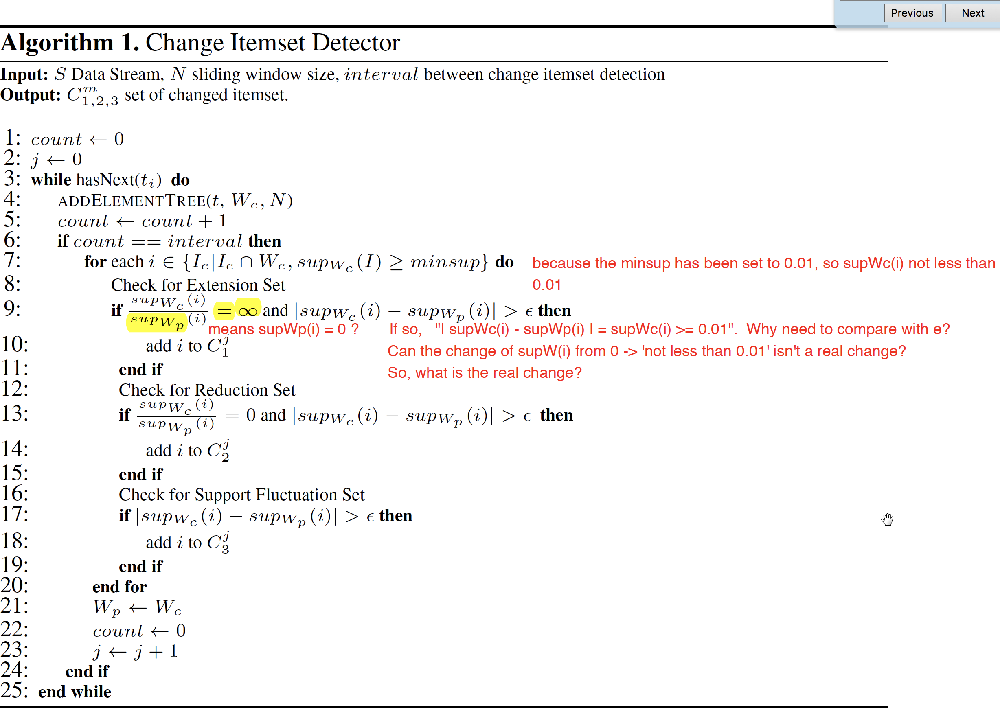

# Summary of Change Itemset Mining in Data Streams
**Summary**

In the article, Zhang, Dobbie, and Koh(2013) focus on how to identify the change itemset in data stream. They are the first to introduce three types of changes, extension, reduction and support fluctuation.
Unlike the other researches, the scale of support change of the frequent itemset over two sliding windows are measured to identify whether they belong to either three types of change.
The authors used Hoeffding bound in compare with fixed bound to signal out the significant support changes
The algorithm is evaluated by experiments in terms of accuracy and efficiency. It turns out that it has high accuracy and good performance.

**Some question or further work.**

1. I need more time to get a better understand of 'Hoeffding’s Inequality' so as to know where is the $\epsilon=\sqrt{\frac{R^2ln(1/\delta)}{2N}}$ from.

2. Please see the attachment 

3. For "5.2 Execution runtime" it give "Average Runtime in Seconds", but I could not find the standard runtime to compare with. So don't know how fast it is.

**What I think the data stream is**

As far as I know, it is a unfixed-size data that changing (usually increasing) over time, e.g. transection records of a running super market, traffic records of an airport.
The records are of similar function or meaning and with similar types of data.
A data stream is interesting because it reflect the changing world and changes with some kind of rule. That why we need to find out the rule and how the rule changes.
