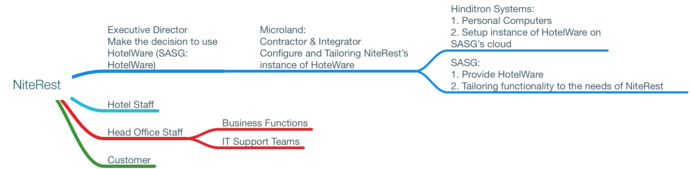

Full version refer the .page doc

#	Stake Holder analysis for NiteRest Hotels project

## Identify Stakeholders
+ NiteRest:
  + Executive Director of Hotel group (Make decision to implement HotelWare)
    - must aware enough regarding to the big situation
    - Short time, can't finish on time
    - unclear requirement
    - big change to all the hotels' Staff
    - Could be fail in integrating old data.
    - Could deduct the customer satisfaction index

  + Customer

  + Hotel Staff
    - big change in a short time, preparation is need in advance.
    - collect the requirement as soon so possible
    - data migration Plan
    - prototype

  + Head Office Staff
    - prepare for the new system, data migration or get use to the new one
    - backup procedure for the failure of the new system
    - prototype

  + Project Management Team

+ SASG(Sleep Away Software Group)

+ Microland:
  + The Supplier:  Corporation (main contractor and System Integrator)

+ Executive

## Prioritise Stakeholders
Executive Director

## Stakeholder Mapping

## Stakeholder Action Plan

# Criteria for declaring the project as a success?
